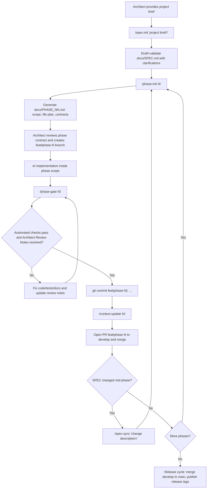

# SDD Template

A template repository for building software projects with a strict Spec-Driven Development (SDD) workflow.

This repo is not an application. It is a product factory made of:

- `workflow/` — reusable SDD workflow assets (playbooks, project-file templates, CLI glue).
- `templates/<template-id>/` — stack-specific project snapshots.
- `sdd` CLI — project initialization, maintenance, and upgrade tooling.

## What You Get

Generated projects come with:

- a phased delivery workflow (`spec-init` -> `phase-init` -> gate -> context update)
- agent guardrails (`AGENTS.md`, `CLAUDE.md`)
- stack runtime source code (backend, frontend, infra files)
- upgrade metadata for safe managed-file updates

Available templates:

- [FastAPI + Nuxt](templates/fastapi-nuxt/README.md)
- [FastAPI + React Router SSR](templates/fastapi-react-router/README.md)

## Quick Start

```bash
uv run sdd init --template fastapi-react-router --project-name my-project ./my-project
cd my-project
./scripts/init-project.sh my-project example.com admin@example.com
docker compose up --build
```

Then follow the generated project's stack guide:

- `docs/STACK.md` (setup, commands, conventions)
- `DEPLOY.md` (production rollout)

## How To Work On A Generated Project

1. Run `/spec-init "project brief"` to draft and validate `docs/SPEC.md`.
2. Run `/phase-init N` to scaffold the phase contract.
3. Implement only what `docs/PHASE_NN.md` allows.
4. Run `/phase-gate N` until all checks and review notes are resolved.
5. Run `/context-update N` to sync `CONTEXT`, `STATE`, and `CHANGELOG`.
6. Merge phase branch and continue with the next phase.

## Project Work Scheme



Stage-to-command map:

| Stage | Purpose | Command / action |
|---|---|---|
| Spec initialization | Build and validate the first complete specification | `/spec-init "description"` |
| Spec definition | Refine approved product intent and boundaries | Edit `docs/SPEC.md` |
| Phase scaffolding | Create scoped executable contract | `/phase-init N` |
| Implementation | Deliver only approved scope | Code + tests in phase files |
| Quality gate | Verify automated checks and unresolved notes | `/phase-gate N` |
| Manual review loop | Capture/fix architect findings | Update `Architect Review Notes`, then re-run `/phase-gate N` |
| Phase finalization | Persist contract updates | `/context-update N` |
| Integration | Merge validated phase | PR `feat/phase-N` -> `develop` |
| Spec drift handling | Resync active phases after SPEC edits | `/spec-sync "description"` |
| Final release | Publish stable state | merge `develop` -> `main`, then tag/release |

## Deployment

Deployment is template-specific. Use the generated project's `DEPLOY.md` as the source of truth.

Reference deployment guides in this template repo:

- [Nuxt template deploy guide](templates/fastapi-nuxt/source/DEPLOY.md)
- [React Router template deploy guide](templates/fastapi-react-router/source/DEPLOY.md)

Typical production model:

- Docker Compose (`docker-compose.yml` + `docker-compose.prod.yml`)
- Nginx reverse proxy + TLS
- Backend + frontend + Postgres + Redis containers

## Operations (Run / Manage)

Inside a generated project:

```bash
# Start in background
docker compose up -d --build

# Check status
docker compose ps

# Tail logs
docker compose logs -f

# Restart a service
docker compose restart backend

# Run backend tests
docker compose exec backend pytest

# Run frontend checks
docker compose exec frontend pnpm test
```

Use stack-local commands from the generated `docs/STACK.md` for full validation paths.

## Updating Existing Projects

Use `sdd upgrade` from inside the generated project.

```bash
# Preview managed updates
uv run sdd upgrade --check

# Apply safe managed updates
uv run sdd upgrade --apply

# Preview against current workspace (maintainer/debug mode)
uv run sdd upgrade --source workspace-current --check
```

Useful inspection helpers:

```bash
# Verify workflow/template composition state
uv run sdd integrate --check

# Resolve active gate metadata and helper source
uv run sdd gate resolve
```

## Maintainer Workflow (This Repository)

When changing this template repository itself:

```bash
# Validate a template structure
uv run sdd release validate --scope template --template fastapi-nuxt --skip-tag-checks

# Validate full release readiness (workflow + template)
uv run sdd release validate --scope all --skip-tag-checks

# Inspect release coordinate status
uv run sdd release status --template fastapi-nuxt
```

Release process reference:

- [docs/RELEASE.md](docs/RELEASE.md)

Template authoring reference:

- [docs/TEMPLATE_AUTHORING.md](docs/TEMPLATE_AUTHORING.md)

## File Map

- [workflow/docs/playbooks/README.md](workflow/docs/playbooks/README.md) — canonical workflow playbooks
- [workflow/project-files/AGENTS.md.template](workflow/project-files/AGENTS.md.template) — guardrails shipped to projects
- [workflow/project-files/CLAUDE.md.template](workflow/project-files/CLAUDE.md.template) — Claude adapter template
- [AGENTS.md](AGENTS.md) — maintainer rules for this repository
- [CLAUDE.md](CLAUDE.md) — maintainer adapter for this repository
