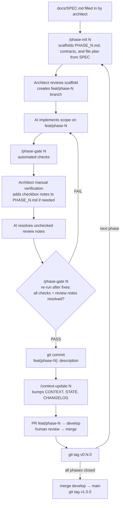

# SDD Template — Spec-Driven Development Pipeline

> A reusable pipeline for AI-assisted, phased delivery. The **architect** defines the product intent;
> `phase-init` scaffolds the phase contract and file plan; the **AI** implements within scope; **gates** enforce quality before every commit.

---

## What this template is

The SDD pipeline is a **stack-agnostic process** for delivering software in atomic, gated phases:

- **Documents** encode intent (`SPEC`), a living contract (`CONTEXT`), progress (`STATE`), a change history (`CHANGELOG`), and scoped tasks (`PHASE_XX`).
- **Skills** (slash commands) automate phase scaffolding, gate checks, and doc synchronisation.
- **Rules** in [AGENTS.md](AGENTS.md) (with [CLAUDE.md](CLAUDE.md) as a thin Claude adapter) keep AI agents inside the phase scope and force a passing gate before commit.
- **Repo memory files** inside each template (for example `templates/<id>/source/docs/DECISIONS.md`
  and `templates/<id>/source/docs/KNOWN_GOTCHAS.md`) keep architecture and operational context
  stable across agent sessions.

The repository now ships multiple concrete stacks:

- [templates/fastapi-nuxt](templates/fastapi-nuxt/README.md) — FastAPI + Nuxt 4
- [templates/fastapi-react-router](templates/fastapi-react-router/README.md) — FastAPI + React Router SSR

Each template owns its own stack guide under `templates/<id>/source/docs/STACK.md`. `sdd init`
composes generated projects from `workflow/` plus `templates/<id>/source/`. The repository root is
now a template-authoring workspace only: it owns `workflow/`, `templates/`, tests, and maintainer
docs, but it is not a runnable product stack.

Maintainers adding another stack should start with
**[docs/TEMPLATE_AUTHORING.md](docs/TEMPLATE_AUTHORING.md)** and
`uv run sdd register-template templates/<template-id> --write`.
When validating maintainer-only experiments under `dev/`, use `uv run sdd dev diff` and
`uv run sdd dev promote` only to map changes back to authoritative sources; generated files in
`dev/` are not promotion targets.
The template-repo CI now validates both shipped templates at the runtime level too: backend lint,
backend tests, frontend validation, and image builds all run for both templates, while Playwright
E2E remains local-only by default.

---

## Quick start

1. **Initialise a new project** from this template:
   ```bash
   uv run sdd init --template fastapi-react-router --project-name user-dashboard ./user-dashboard
   cd user-dashboard
   ./scripts/init-project.sh user-dashboard example.com admin@example.com
   ```
   `sdd init` is the canonical entrypoint for creating a working copy of the template. It now
   composes the generated project from `workflow/` plus the selected `templates/<id>/source/`, writes
   the workflow-managed `AGENTS.md` and `CLAUDE.md` files, and records provenance/ownership
   metadata in `.sdd-origin.yaml`, `.sdd-lock.yaml`, and `.sdd/ownership.yaml`.
   The compatibility script still handles stack-specific placeholder replacement, `.env`
   generation, and random secret creation for the selected stack.
   Downstream projects can now preview managed updates with `uv run sdd upgrade --check`
   and apply the safe subset with `uv run sdd upgrade --apply`. By default, upgrades resolve
   against released workflow/template artifacts. Maintainers can still inspect the current
   checkout explicitly with `uv run sdd upgrade --source workspace-current --check`.
   Generated projects can inspect their active gate helper/docs contract with
   `uv run sdd gate resolve`.
   The safe apply path now includes clean three-way text merges for managed files when the
   installed baseline can be reconstructed reliably.
   Maintainers can inspect and validate component release coordinates with
   `uv run sdd release status` and `uv run sdd release validate --scope workflow|template --skip-tag-checks`
   before tagging `workflow/v...` and `template/<id>/v...`.
   Prerequisites and post-init steps →
   **[templates/fastapi-react-router/source/docs/STACK.md](templates/fastapi-react-router/source/docs/STACK.md#prerequisites)**.

2. **Inside the generated project, fill in `docs/SPEC.md`** — the shipped canonical copy comes
   from the selected template's `templates/<id>/source/docs/SPEC.md`.

3. **Inside the generated project, scaffold phase 1**: `/phase-init 01` — it generates
   `docs/PHASE_01.md` from SPEC. The shipped canonical phase template comes from the selected
   template's `templates/<id>/source/docs/PHASE_TEMPLATE.md`.

4. **Iterate the phase cycle** (diagram below) until all phases are closed, then release.

---

## Pipeline



**Mid-flight SPEC edits** → run `/spec-sync [description]` before continuing.
Affected phases are marked `⚠️ NEEDS_REVIEW` in the generated project's `docs/STATE.md` until resolved.

**Hotfixes** → branch `hotfix/*` from `main`, merge into both `main` and `develop`.

---

## Skills (slash commands)

| Command | When to use |
|---------|-------------|
| `/spec-sync [description]` | Immediately after editing the generated project's `docs/SPEC.md` |
| `/phase-init [N]` | To scaffold the next generated-project `docs/PHASE_XX.md` from SPEC |
| `/phase-gate [N]` | Before committing — runs automated checks (including the local deterministic Playwright Chromium E2E path) and also fails if `Architect Review Notes` still contain unchecked items |
| `/context-update [N]` | After the gate passes — bumps `CONTEXT.md` version, updates `STATE.md` and `CHANGELOG.md` |

Shipped skill definitions live under `templates/<id>/source/.claude/skills/`.
They are Claude Code native, but the underlying workflows can also be followed manually or mapped into other agent runtimes.
Portable workflow playbooks live under [workflow/docs/playbooks/](workflow/docs/playbooks/README.md).

---

## Key documents

| File | What it answers |
|------|----------------|
| `templates/<id>/source/docs/SPEC.md` | Canonical template copy of the strategic brief and domain rules |
| `templates/<id>/source/docs/CONTEXT.md` | Canonical template copy of the living technical contract |
| `templates/<id>/source/docs/STATE.md` | Canonical template copy of the phase tracker |
| `templates/<id>/source/docs/CHANGELOG.md` | Canonical template copy of the contract change history |
| `templates/<id>/source/docs/PHASE_TEMPLATE.md` | Canonical phase template shipped into generated projects |
| `templates/<id>/source/docs/STACK.md` | Canonical stack-specific setup, testing, layout, and conventions for the selected template |
| `templates/<id>/source/docs/AGENT_SETUP.md` | Canonical agent-setup guidance shipped to generated projects |
| `templates/<id>/source/docs/E2E_PIPELINE_CHECKLIST.md` | Optional rollout checklist if a derived project later enables CI E2E |
| `templates/<id>/source/docs/DECISIONS.md` | Canonical ADR-style memory file for derived projects |
| `templates/<id>/source/docs/KNOWN_GOTCHAS.md` | Canonical recurring-pitfall log for derived projects |
| [workflow/docs/playbooks/README.md](workflow/docs/playbooks/README.md) | Portable workflow playbooks for phase-init, gate, sync, and context update |
| `templates/<id>/template.yaml` | Canonical manifest for a template |
| [docs/TEMPLATE_AUTHORING.md](docs/TEMPLATE_AUTHORING.md) | Maintainer guide for adding and registering new templates |
| [`.codex/skills/template-repo-maintainer/SKILL.md`](.codex/skills/template-repo-maintainer/SKILL.md) | Repo-only maintainer skill for AI-assisted template development |
| [AGENTS.md](AGENTS.md) | Canonical rules — scope lock, gate-before-commit, docs lookup, permission handoff |
| [CLAUDE.md](CLAUDE.md) | Thin Claude adapter — points at AGENTS.md |

---

## Philosophy

- **Architect defines intent, phase-init scaffolds contracts, AI fills them in.** The architect writes SPEC, reviews the phase scaffold, and approves merges. `phase-init` generates the phase contract and file plan, and the AI produces code, tests, and doc updates strictly inside that scope.
- **Contracts beat conventions.** Every phase has an explicit contract (scope, files, endpoints, types, env vars). Nothing implicit.
- **Gates, not promises.** Quality is proven by a passing `/phase-gate` report (unit + type + e2e + smoke + resolved architect review notes), not by the AI claiming "looks good".
- **Docs are alive.** `CONTEXT.md` is the single source of truth for what exists; `STATE.md` tracks progress; `CHANGELOG.md` records why things changed. `CONTEXT.md` must never lag more than one phase behind.

### Manual Verification Loop

`/phase-gate` is intentionally lightweight for manual review:

1. Run `/phase-gate N` to get the automated baseline.
2. Manually verify the phase as the architect.
3. Record any findings in `docs/PHASE_XX.md` under `Architect Review Notes` as simple unchecked checklist items.
4. Have the AI fix those unchecked items and mark them resolved.
5. Run `/phase-gate N` again only after the fixes are in place.

Adding unchecked architect review notes by itself does not complete the loop. Those notes mean the phase is still open. The phase is only ready to commit when the fixes are done, the automated checks are green, and there are no unchecked architect review items left.

For derived repositories, keep E2E in the local `/phase-gate` path by default. If a project later
decides to make E2E part of CI, use the selected template's
`templates/<id>/source/docs/E2E_PIPELINE_CHECKLIST.md` as an opt-in rollout guide rather than a
default branch-protection rule.

---

## Stack

The repository now ships multiple stack templates. For prerequisites, environment setup, commands,
project structure, testing, and per-module style guides, read the selected template's
`templates/<id>/source/docs/STACK.md`.

Future versions will publish the workflow and stack overlays as separate packages so the same SDD process can wrap any stack.
