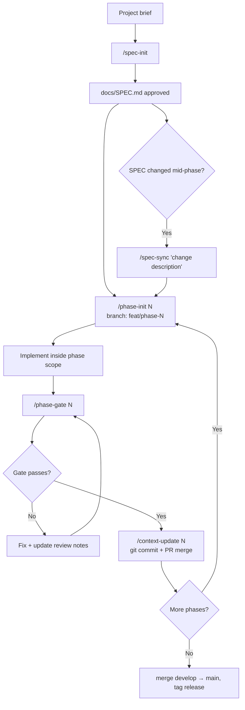

# SDD Template

A template repository for building software projects with a Spec-Driven Development (SDD) workflow.

This repo is a project factory, not an application. It contains:

- `workflow/` — reusable SDD workflow assets (playbooks, project-file templates, CLI glue)
- `templates/<template-id>/` — stack-specific project snapshots
- `sdd` CLI — project initialization, maintenance, and upgrade tooling

Available templates:

- [FastAPI + Nuxt](templates/fastapi-nuxt/README.md)
- [FastAPI + React Router SSR](templates/fastapi-react-router/README.md)

---

## Step 1 — Create a project from the template

```bash
uv run sdd init --template fastapi-react-router --project-name my-project ./my-project
cd my-project
./scripts/init-project.sh my-project example.com admin@example.com
docker compose up --build
```

This generates a full project with a phased delivery workflow, agent guardrails, and stack source code. From here on, all SDD work happens **inside the generated project**.

Generated project references:

- `docs/STACK.md` — setup, commands, conventions
- `DEPLOY.md` — production rollout

---

## Step 2 — Write the spec

```
/spec-init "describe what you are building"
```

This drafts and validates `docs/SPEC.md` through a clarification dialogue. The spec defines the full product scope and is the contract all phases execute against. **Do not start implementation before the spec is approved.**

If the spec needs to change after phases have started, run `/spec-sync "what changed"` to reconcile it with active phases before continuing.

---

## Step 3 — Scaffold a phase

```
/phase-init N
```

A phase is a time-boxed delivery unit. This command produces `docs/PHASE_NN.md`, which contains:

- the exact scope for this phase (features, files, contracts)
- acceptance criteria and test requirements
- explicit list of what is **out of scope**

Review `docs/PHASE_NN.md` before writing any code. Create a branch `feat/phase-N` for this phase's work.

---

## Step 4 — Implement inside phase scope

Write code and tests. Stay inside the scope defined in `docs/PHASE_NN.md`. Do not implement anything not listed there — save it for a later phase.

---

## Step 5 — Run the quality gate

```
/phase-gate N
```

Runs automated checks (linting, tests, contract compliance) and produces a structured review. If anything fails:

1. Fix the code or tests.
2. Add a note to the `Architect Review Notes` section in `docs/PHASE_NN.md`.
3. Re-run `/phase-gate N`.

Repeat until the gate passes with all notes resolved.

---

## Step 6 — Finalize the phase

```
/context-update N
```

Syncs `CONTEXT.md`, `STATE.md`, and `CHANGELOG.md` with the completed phase. Then:

```bash
git commit -m "feat(phase-N): ..."
# open PR: feat/phase-N -> develop, merge
```

Return to Step 3 for the next phase, or merge `develop` into `main` and tag a release when all phases are done.

---

## Full workflow at a glance



---

## Operations (inside a generated project)

```bash
# Start in background
docker compose up -d --build

# Check status
docker compose ps

# Tail logs
docker compose logs -f

# Restart a service
docker compose restart backend

# Run backend tests
docker compose exec backend pytest

# Run frontend checks
docker compose exec frontend pnpm test
```

---

## Updating an existing project

```bash
# Preview managed updates
uv run sdd upgrade --check

# Apply safe managed updates
uv run sdd upgrade --apply
```

---

## Deployment

Deployment is template-specific. Use the generated project's `DEPLOY.md` as the source of truth.

Reference guides in this repo:

- [Nuxt template deploy guide](templates/fastapi-nuxt/source/DEPLOY.md)
- [React Router template deploy guide](templates/fastapi-react-router/source/DEPLOY.md)

---

## Maintainer workflow (this repository)

When changing this template repo itself:

```bash
# Validate a template structure
uv run sdd release validate --scope template --template fastapi-nuxt --skip-tag-checks

# Validate full release readiness
uv run sdd release validate --scope all --skip-tag-checks

# Inspect release coordinate status
uv run sdd release status --template fastapi-nuxt
```

References:

- [docs/RELEASE.md](docs/RELEASE.md)
- [docs/TEMPLATE_AUTHORING.md](docs/TEMPLATE_AUTHORING.md)

---

## File map

- [workflow/docs/playbooks/README.md](workflow/docs/playbooks/README.md) — canonical workflow playbooks
- [workflow/project-files/AGENTS.md.template](workflow/project-files/AGENTS.md.template) — guardrails shipped to projects
- [workflow/project-files/CLAUDE.md.template](workflow/project-files/CLAUDE.md.template) — Claude adapter template
- [AGENTS.md](AGENTS.md) — maintainer rules for this repository
- [CLAUDE.md](CLAUDE.md) — maintainer adapter for this repository
