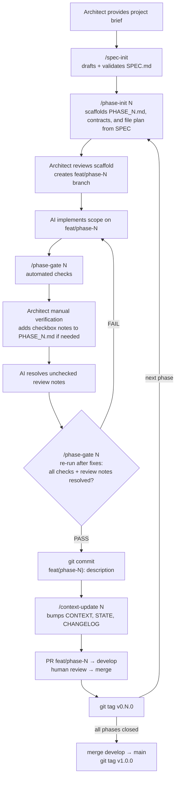

# SDD Template — Spec-Driven Development Pipeline

> A reusable pipeline for AI-assisted, phased delivery. The **architect** defines the product intent;
> `spec-init` drafts the spec, `phase-init` scaffolds phase contracts, the **AI** implements within scope, and **gates** enforce quality before every commit.

---

## What this template is

The SDD pipeline is a **stack-agnostic process** for delivering software in atomic, gated phases:

- **Documents** encode intent (`SPEC`), a living contract (`CONTEXT`), progress (`STATE`), a change history (`CHANGELOG`), and scoped tasks (`PHASE_XX`).
- **Skills** (slash commands) automate phase scaffolding, gate checks, and doc synchronisation.
- **Rules** in [AGENTS.md](AGENTS.md) (with [CLAUDE.md](CLAUDE.md) as a thin Claude adapter) keep AI agents inside the phase scope and force a passing gate before commit.
- **Repo memory files** ([docs/DECISIONS.md](docs/DECISIONS.md), [docs/KNOWN_GOTCHAS.md](docs/KNOWN_GOTCHAS.md)) keep architecture and operational context stable across agent sessions.

The reference implementation ships with a concrete stack (FastAPI + Nuxt 4 + PostgreSQL + Docker).
Everything stack-specific — setup commands, directory layout, testing tools, migrations, and the
Nuxt `prepare` pre-step required before frontend type/tests — lives in
**[docs/STACK.md](docs/STACK.md)**. Swap that file when swapping stacks; the pipeline does not change.

---

## Quick start

1. **Initialise a new project** from this template:
   ```bash
   uv run sdd init --template fastapi-nuxt --project-name user-dashboard ./user-dashboard
   cd user-dashboard
   ./scripts/init-project.sh user-dashboard example.com admin@example.com
   ```
   `sdd init` is the canonical entrypoint for creating a working copy of the template. The compatibility script still replaces placeholders, generates `.env`, creates random secrets, and copies both `AGENTS.md` and `CLAUDE.md` into place for the current reference stack.
   Prerequisites and post-init steps → **[docs/STACK.md](docs/STACK.md#prerequisites)**.

2. **Initialize [docs/SPEC.md](docs/SPEC.md)**: `/spec-init "project brief"` — drafts and validates the specification.

3. **Scaffold phase 1**: `/phase-init 01` — generates `docs/PHASE_01.md` from SPEC.

4. **Iterate the phase cycle** (diagram below) until all phases are closed, then release.

Optional, when you want compressed agent responses for long debug loops:

```bash
./scripts/install-caveman.sh
```

Then activate only when needed (`/caveman`, Codex: `$caveman`).

---

## Pipeline



**Mid-flight SPEC edits** → run `/spec-sync [description]` before continuing.
Affected phases are marked `⚠️ NEEDS_REVIEW` in `docs/STATE.md` until resolved.

**Hotfixes** → branch `hotfix/*` from `main`, merge into both `main` and `develop`.

---

## Skills (slash commands)

| Command | When to use |
|---------|-------------|
| `/spec-init [project brief]` | At project start (or major reset) to draft and critically validate [docs/SPEC.md](docs/SPEC.md) |
| `/spec-sync [description]` | Immediately after editing [docs/SPEC.md](docs/SPEC.md) |
| `/phase-init [N]` | To scaffold the next [docs/PHASE_XX.md](docs/PHASE_TEMPLATE.md) from SPEC |
| `/phase-gate [N]` | Before committing — runs automated checks (including deterministic Playwright Chromium E2E) and also fails if `Architect Review Notes` still contain unchecked items |
| `/context-update [N]` | After the gate passes — bumps `CONTEXT.md` version, updates `STATE.md` and `CHANGELOG.md` |

Skill definitions live under [.claude/skills/](.claude/skills/).
They are Claude Code native, but the underlying workflows can also be followed manually or mapped into other agent runtimes.
Portable workflow playbooks live under [workflow/docs/playbooks/](workflow/docs/playbooks/README.md).

---

## Key documents

| File | What it answers |
|------|----------------|
| [docs/SPEC.md](docs/SPEC.md) | What are we building? What are the rules? |
| [docs/CONTEXT.md](docs/CONTEXT.md) | What is in the system right now? (versioned contract) |
| [docs/STATE.md](docs/STATE.md) | Where are we in the process? What is blocked? |
| [docs/CHANGELOG.md](docs/CHANGELOG.md) | Why did the contract change? Which phases were affected? |
| [docs/PHASE_XX.md](docs/PHASE_TEMPLATE.md) | What exactly should the AI implement this iteration? |
| [docs/STACK.md](docs/STACK.md) | Stack-specific setup, testing, layout, and conventions |
| [docs/AGENT_SETUP.md](docs/AGENT_SETUP.md) | Context7, MCP, and cross-agent setup guidance |
| [docs/E2E_PIPELINE_CHECKLIST.md](docs/E2E_PIPELINE_CHECKLIST.md) | Optional rollout guide if a derived project later enables CI E2E |
| [docs/DECISIONS.md](docs/DECISIONS.md) | Short ADR-style technical decisions worth remembering |
| [docs/KNOWN_GOTCHAS.md](docs/KNOWN_GOTCHAS.md) | Repeated pitfalls, symptoms, and shortest safe fixes |
| [workflow/docs/playbooks/README.md](workflow/docs/playbooks/README.md) | Portable workflow playbooks for spec-init, phase-init, gate, sync, and context update |
| [AGENTS.md](AGENTS.md) | Canonical rules — scope lock, gate-before-commit, docs lookup, permission handoff |
| [CLAUDE.md](CLAUDE.md) | Thin Claude adapter — points at AGENTS.md |

---

## Philosophy

- **Architect defines intent, spec-init hardens SPEC, phase-init scaffolds contracts.** The architect provides the brief, `spec-init` drafts and validates `SPEC.md`, then `phase-init` generates the phase contract and file plan. The AI produces code, tests, and doc updates strictly inside that scope.
- **Contracts beat conventions.** Every phase has an explicit contract (scope, files, endpoints, types, env vars). Nothing implicit.
- **Gates, not promises.** Quality is proven by a passing `/phase-gate` report (unit + type + e2e + smoke + resolved architect review notes), not by the AI claiming "looks good".
- **Docs are alive.** `CONTEXT.md` is the single source of truth for what exists; `STATE.md` tracks progress; `CHANGELOG.md` records why things changed. `CONTEXT.md` must never lag more than one phase behind.

### Manual Verification Loop

`/phase-gate` is intentionally lightweight for manual review:

1. Run `/phase-gate N` to get the automated baseline.
2. Manually verify the phase as the architect.
3. Record any findings in `docs/PHASE_XX.md` under `Architect Review Notes` as simple unchecked checklist items.
4. Have the AI fix those unchecked items and mark them resolved.
5. Run `/phase-gate N` again only after the fixes are in place.

Adding unchecked architect review notes by itself does not complete the loop. Those notes mean the phase is still open. The phase is only ready to commit when the fixes are done, the automated checks are green, and there are no unchecked architect review items left.

For derived repositories, keep E2E in the local `/phase-gate` path by default. If the project later decides to add CI E2E, use [docs/E2E_PIPELINE_CHECKLIST.md](docs/E2E_PIPELINE_CHECKLIST.md) as an opt-in rollout guide instead of a default branch-protection rule.

---

## Stack

This template's reference implementation is **FastAPI + Nuxt 4 + PostgreSQL + Docker**.
For prerequisites, environment setup, commands, project structure, testing, and per-module style guides, see **[docs/STACK.md](docs/STACK.md)**.

Future versions will publish the workflow and stack overlays as separate packages so the same SDD process can wrap any stack.
